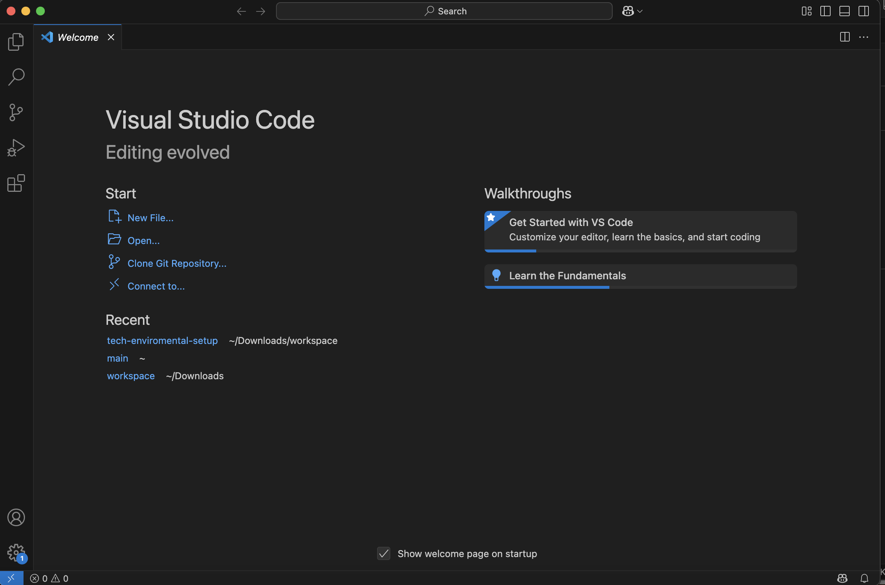
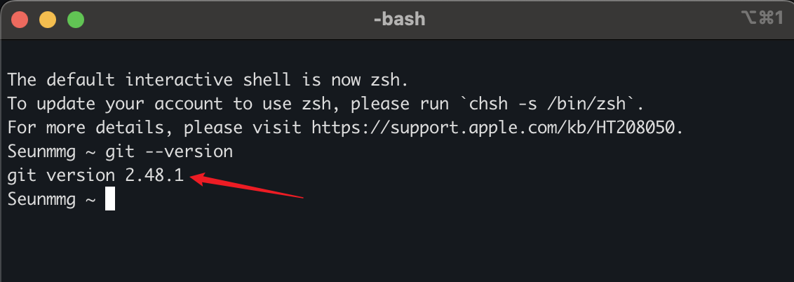
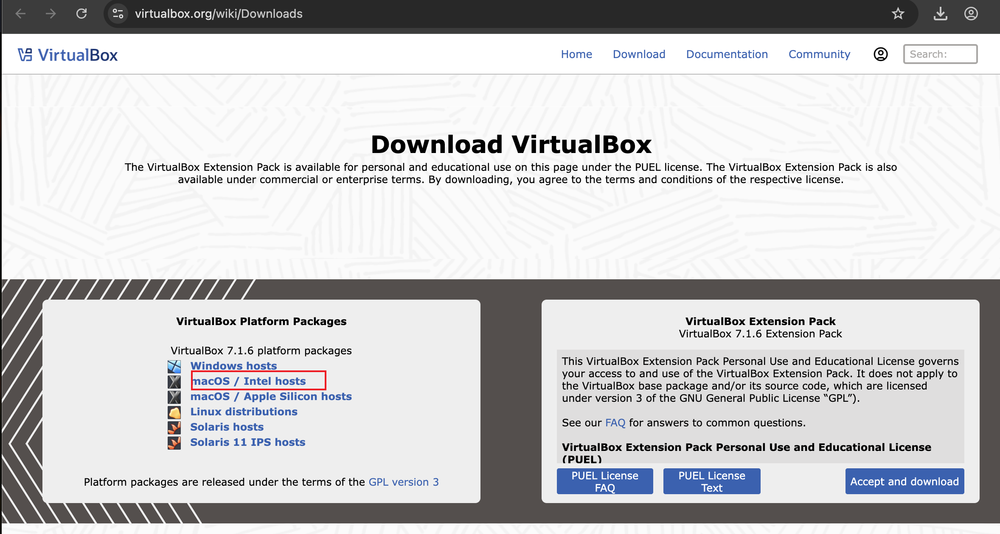

# Tech Enviromental Setup

In this project, i will be documenting various software prerequisites for DevOps

## Visual Studio Code

VScode is a powerful, lightweight and versatile code editor developed by Microsoft, designed for a wide range of programming gitlanguages and development tasks.

## Git

Git is a distributed version control system used to track changes in computer files, especially code.It allows developers to work collaboratively on projects, manage different versions of their code, and revert to previous states if needed. 

## Virtual Box

VirtualBox is a free and open-source virtualization software that allows users to run multiple operating systems on a single computer simultaneously.

## Ubuntu

Ubuntu is a free, open-source Linux-based operating system (OS) widely used on PCs, servers, and cloud platforms.

## Github

GitHub is a web-based platform used by developers to store, manage, and collaborate on code projects. It utilizes Git, a version control system, to track changes and allow multiple people to work on the same project simultaneously.

## AWS

AWS, is a comprehensive cloud computing platform offered by Amazon that provides on-demand computing, storage, and various other services.

